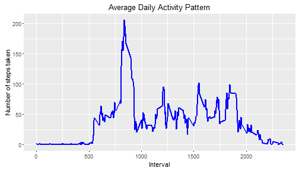
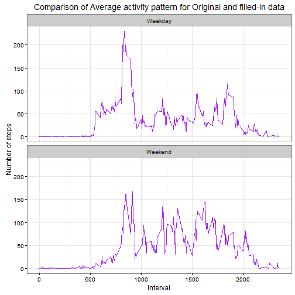

##Introduction

This document forms part of the Coursera Reproducible Research Course Assignment #1 and contains the results and methods used to answer the assignment questions. The assignment makes use of a dataset collected from a personal activity monitoring device. The data is comprised of the number of steps taken during 5-minute intervals, through out the day, by an anonymous individual for a two month period i.e. October and November, 2012. This document is first prepared as a single R markdown document which is then processed by knitr to transform it into an HTML file. The assignment aims at studying the data patterns across a typical day and 5-minute intervals throught out the day. The impact of imputing missing values on the mean and median of the data and variation in average daily patterns between weekdays and weekends is also explored.

####Loading necessary libraries


```r
library(knitr)
knitr::opts_chunk$set(fig.path='figure/')
library(ggplot2) # ggplot2 will be used for plotting figures
```

##Loading, formatting and checking the input data

The input data for this assignment comprises data from a personal activity monitoring device collected by an anonymous individual. The data contains the number of steps taken in 5 minute intervals each day for a period of two months.

####Loading the data using read.csv() function

```r
activitydat <- read.csv("activity.csv", header = TRUE, colClasses=c("numeric", "character", "numeric"))
```

####Changing the data field format as required

```r
activitydat$date<-as.Date(activitydat$date)
activitydat$interval<-as.factor(activitydat$interval)
```

####Checking the data using str() function

```r
str(activitydat)
```

```
## 'data.frame':	17568 obs. of  3 variables:
##  $ steps   : num  NA NA NA NA NA NA NA NA NA NA ...
##  $ date    : Date, format: "2012-10-01" "2012-10-01" ...
##  $ interval: Factor w/ 288 levels "0","5","10","15",..: 1 2 3 4 5 6 7 8 9 10 ...
```

##What is mean total number of steps taken per day?

####Calculating mean total number of steps taken per day
As per the instructions missing values are ignored for this calculation.


```r
totalStepsperDay <- aggregate(steps ~ date, activitydat, sum)
colnames(totalStepsperDay) <- c("date","steps")
head(totalStepsperDay)
```

```
##         date steps
## 1 2012-10-02   126
## 2 2012-10-03 11352
## 3 2012-10-04 12116
## 4 2012-10-05 13294
## 5 2012-10-06 15420
## 6 2012-10-07 11015
```

####Plotting the histogram of the total number of steps taken per day

```r
g <- ggplot(totalStepsperDay, aes(x=steps))
g <- g + geom_histogram(fill = "brown", binwidth = 1000) +
    xlab("Total number of Steps taken per day") +
    ylab("Frequency") +
    ggtitle('Histogram of Total number of Steps per Day')
print(g)
```


####Calculating the mean and median of the number of steps taken per day

```r
stepsMean   <- as.integer(mean(totalStepsperDay$steps, na.rm=TRUE))
stepsMedian <- as.integer(median(totalStepsperDay$steps, na.rm=TRUE))
```

The mean is 10766 and the median is 10765

##What is the average daily activity pattern?

####Calculating the the average number of steps taken during each of the 5-minute interval, averaged across all days

```r
avgStepsper5min <- aggregate(activitydat$steps, 
                             by = list(interval = activitydat$interval),
                             FUN=mean, na.rm=TRUE)
avgStepsper5min$interval <- as.integer(levels(avgStepsper5min$interval)[avgStepsper5min$interval])
colnames(avgStepsper5min) <- c("interval", "steps")
```

####Plotting the histogram of the average number of steps taken during each of the 5-minute interval averaged across all days


```r
g <- ggplot(avgStepsper5min, aes(x=interval, y=steps))
g <- g + geom_line(color="blue", size=1) +  
    xlab("Interval") +
    ylab("Number of steps taken") +
    ggtitle('Average Daily Activity Pattern')
    print(g)
```



####Which 5-minute interval, on average across all the days in the dataset, contains the maximum number of steps?


```r
maxInterval <- avgStepsper5min[which.max(avgStepsper5min$steps),]
maxInterval$steps<-as.integer(maxInterval$steps)
```

The 5-minute interval that contains the maximum number of steps is 835th with 206 steps.

##Imputing missing values

There are a number of days/intervals where there are missing values (coded as NA). The presence of missing days may introduce bias into some calculations or summaries of the data.

####Calculating the total number of missing values in the dataset (i.e. the total number of rows with NAs)


```r
rowsWithNA<-activitydat[is.na(activitydat$steps),]
numrowsWithNA<-length(rowsWithNA$steps)
```

The total number of rows with missing values or NAs in the dataset is 2304

####Strategy for filling in all of the missing values in the dataset

The missing values are filled using the mean value of the corresponding 5-minute interval averaged across all the days.


```r
rowsWithNA["steps"] <- lapply("steps", function(x) avgStepsper5min[[x]][match(rowsWithNA$interval, avgStepsper5min$interval)])
```

####Creating a new dataset that is equal to the original dataset but with the missing data filled in.


```r
rowsWithoutNA<-activitydat[!is.na(activitydat$steps),]
filledActivitydat<-rbind(rowsWithoutNA,rowsWithNA)
```
####Checking the new filled-in dataset

```r
str(filledActivitydat)
```

```
## 'data.frame':	17568 obs. of  3 variables:
##  $ steps   : num  0 0 0 0 0 0 0 0 0 0 ...
##  $ date    : Date, format: "2012-10-02" "2012-10-02" ...
##  $ interval: Factor w/ 288 levels "0","5","10","15",..: 1 2 3 4 5 6 7 8 9 10 ...
```

####Calculating the total number of steps taken per day for filled-in data


```r
totalStepsperDayNew <- aggregate(steps ~ date, filledActivitydat, sum)
colnames(totalStepsperDayNew) <- c("date","steps")
```

####Plotting the histogram of the total number of steps taken per day for the filled-in data


```r
g <- ggplot(totalStepsperDayNew, aes(x=steps))
g <- g + geom_histogram(fill = "darkgreen", binwidth = 1000) +
    xlab("Total number of Steps taken per day") +
    ylab("Frequency") +
    ggtitle('Histogram of Total number of steps per day for filled-in data')
print(g)
```


####Comparing the mean and median of the filled-in data with the data with missing values


```r
stepsMeanNew   <- as.integer(mean(totalStepsperDayNew$steps, na.rm=TRUE))
stepsMedianNew <- as.integer(median(totalStepsperDayNew$steps, na.rm=TRUE))
```

The comparison is as below:

Original data:  Mean    = 10766 and Median = 10765  
Filled data:    Mean    = 10766 and Median = 10766

It is observed that by filling the missing values the mean and median of the data have become identical. The missing values were therefore creting skewness in the data.


##Are there differences in activity patterns between weekdays and weekends?

To do this comparison the data with filled-in missing values will be used.

####Augument filled in dataset with two additional fields i.e. Weekday (day of the week) and WeekdayType (type of day - Weeeday or Weekend)


```r
filledActivitydat$weekday<-as.factor(weekdays(filledActivitydat$date))
filledActivitydat$weekdayType<-"Weekday"
filledActivitydat[filledActivitydat$weekday=="Saturday",]$weekdayType<-"Weekend"
filledActivitydat[filledActivitydat$weekday=="Sunday",]$weekdayType<-"Weekend"
```

####Subset the dataset to segregate it into two categories i.e. by Weekday and Weekend

```r
filledActivitydatWeekday<-subset(filledActivitydat,weekdayType=="Weekday")
filledActivitydatWeekend<-subset(filledActivitydat,weekdayType=="Weekend")
```

####Calculate the average number of steps taken during each of the 5-minute interval, averaged across all weekdays


```r
StepsperIntervalWeekday <- aggregate(filledActivitydatWeekday$steps, 
                             by = list(weekdayType=filledActivitydatWeekday$weekdayType,interval = filledActivitydatWeekday$interval),
                             FUN=mean, na.rm=TRUE)
StepsperIntervalWeekday$interval <- as.integer(levels(StepsperIntervalWeekday$interval)[StepsperIntervalWeekday$interval])
colnames(StepsperIntervalWeekday) <- c("weekdayType", "interval","steps")
```

####Calculate the average number of steps taken during each of the 5-minute interval, averaged across all weekends


```r
StepsperIntervalWeekend <- aggregate(filledActivitydatWeekend$steps, 
                                     by = list(weekdayType=filledActivitydatWeekend$weekdayType,interval = filledActivitydatWeekend$interval),
                                     FUN=mean, na.rm=TRUE)
StepsperIntervalWeekend$interval <- as.integer(levels(StepsperIntervalWeekend$interval)[StepsperIntervalWeekend$interval])
colnames(StepsperIntervalWeekend) <- c("weekdayType", "interval","steps")
```

####Combine the 5-minute interval averages for weekdays and weekends


```r
StepsperInterval<-rbind(StepsperIntervalWeekday, StepsperIntervalWeekend)
```

####Create panel plot comparing the average number of steps taken per 5-minute interval across weekdays and weekends


```r
g <- ggplot(StepsperInterval, aes(x=interval, y=steps))  
g <- g + geom_line(color="purple") + 
    facet_wrap(~ weekdayType, nrow=2, ncol=1) +
    labs(x="Interval", y="Number of steps") +
    ggtitle('Comparison of Average activity pattern for Original and filled-in data')+
    theme_bw()
print(g)
```



It is observed from the above plots that there is more variation in number of steps taken across the day during the weekend as compared to a typical weekday. The peak number of steps however occurs on weekdays during early hours of the day most likely due to the individual following a routine.

____________________________________________________________________________________________________


